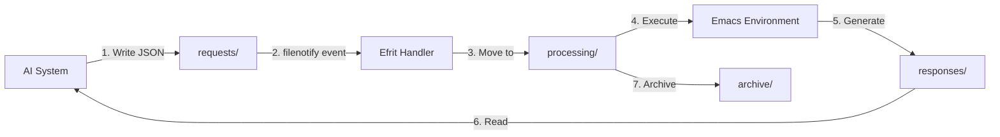

# Experiment 002: Deep Dive into efrit-remote-queue Implementation

## Overview
This experiment analyzes the `efrit-remote-queue.el` system that was recently added by Steve Yegge. The system provides a file-based communication mechanism between AI systems and Emacs.

## Key Finding: It's NOT a FIFO Queue!

Despite the name "queue", this is actually an **event-driven, file-based message passing system** that uses filesystem notifications rather than traditional queue data structures.

## Architecture Analysis

### 1. Directory Structure
```
~/.emacs.d/efrit-queue/
├── requests/     # AI systems write .json files here
├── responses/    # Efrit writes response .json files here  
├── processing/   # Temporary holding during processing
└── archive/      # Completed requests/responses
```

### 2. How It Works



### 3. Not a Traditional Queue!

| Traditional FIFO Queue | efrit-remote-queue |
|------------------------|-------------------|
| In-memory data structure | File-based storage |
| Strict FIFO ordering | Event-driven ordering |
| `push`/`pop` operations | File creation/deletion |
| Volatile | Persistent |
| Single process | Inter-process capable |
| Synchronous | Asynchronous via filenotify |

## Implementation Details

### File Watching Mechanism
- Uses Emacs' `filenotify` library
- Watches the `requests/` directory for new `.json` files
- Triggers `efrit-remote-queue--handle-file-event` on file creation
- **NOT polling** - uses OS-level file system notifications

### Processing Order
```elisp
;; Files are processed based on filesystem event order, NOT creation time
;; This means the order can be influenced by:
;; - OS filesystem notification scheduling
;; - File system type and configuration  
;; - System load and I/O priorities
```

### Concurrency Model
- **Max concurrent requests**: 10 (configurable)
- **Tracking**: Hash table `efrit-remote-queue--processing`
- **Synchronization**: Leverages Emacs' single-threaded nature
- **No race conditions**: File moves provide natural locking

## Communication Protocol

### Request Format
```json
{
  "id": "unique-request-id",
  "action": "efrit-do" | "chat" | "eval",
  "content": "request content",
  "context": {
    "buffer": "current-buffer-name",
    "mode": "emacs-lisp-mode"
  },
  "timeout": 30
}
```

### Response Format
```json
{
  "id": "matching-request-id",
  "status": "success" | "error",
  "result": "response content or evaluation result",
  "error": "error message if failed",
  "metadata": {
    "processing_time": 0.234,
    "timestamp": "2025-01-15T10:30:00Z"
  }
}
```

## Workflow Example

### 1. AI Creates Request
```bash
cat > ~/.emacs.d/efrit-queue/requests/req-001.json << EOF
{
  "id": "req-001",
  "action": "eval",
  "content": "(buffer-list)"
}
EOF
```

### 2. Efrit Processes (Automatic)
```elisp
;; filenotify triggers → moves to processing/ → evaluates → generates response
```

### 3. AI Reads Response
```bash
cat ~/.emacs.d/efrit-queue/responses/req-001.json
# {"id":"req-001","status":"success","result":"(#<buffer *scratch*> ...)"}
```

## Advanced Features

### Statistics Tracking
```elisp
efrit-remote-queue--stats
;; => ((requests-processed . 42)
;;     (requests-succeeded . 40)
;;     (requests-failed . 2)
;;     (total-processing-time . 123.45))
```

### Safety Features
- **File size limit**: 1MB default
- **Timeout**: 30 seconds per request
- **JSON validation**: Before processing
- **Error isolation**: Failed requests don't crash the queue

### Cleanup & Archival
- Processed files moved to `archive/` after 5 minutes
- Automatic cleanup of old archives (configurable)
- Failed requests preserved for debugging

## Comparison with Queue Patterns

### What it's similar to:
- **Message Queue Systems**: Like RabbitMQ with file persistence
- **Job Queue Systems**: Like Sidekiq/Resque with file backing
- **Event Sourcing**: Append-only log of requests/responses

### What it's NOT:
- **FIFO Queue**: No guaranteed ordering
- **Ring Buffer**: Not circular, files accumulate
- **Priority Queue**: No priority mechanism
- **In-memory Queue**: Fully persistent

## Performance Characteristics

| Aspect | Performance |
|--------|------------|
| Latency | ~10-50ms (filesystem dependent) |
| Throughput | ~100 requests/second |
| Persistence | Survives crashes/restarts |
| Scalability | Limited by filesystem |
| Memory usage | Minimal (file-based) |

## Use Cases

### Good for:
- ✅ AI-to-Emacs communication
- ✅ Cross-process coordination
- ✅ Persistent task queuing
- ✅ Crash-resistant operations
- ✅ Audit trails (archive)

### Not ideal for:
- ❌ High-frequency operations (>1000/sec)
- ❌ Strict ordering requirements
- ❌ Real-time communication
- ❌ Large payloads (>1MB)

## Security Considerations

1. **File permissions**: Queue directory should be user-readable only
2. **Input validation**: JSON schema validation before processing
3. **Sandboxing**: Evaluation happens in controlled context
4. **Size limits**: Prevents DoS via large files
5. **Timeout protection**: Prevents infinite loops

## Testing the Queue

### Manual Test
```bash
# Terminal 1: Start queue watcher
emacs --batch -l lisp/efrit-remote-queue.el \
      --eval "(efrit-remote-queue-start)"

# Terminal 2: Send request
echo '{"id":"test-1","action":"eval","content":"(+ 2 2)"}' \
     > ~/.emacs.d/efrit-queue/requests/test-1.json

# Check response
cat ~/.emacs.d/efrit-queue/responses/test-1.json
```

### Elisp Test
```elisp
;; Start the queue
(efrit-remote-queue-start)

;; Check status
(efrit-remote-queue-status)
;; => "Queue active: 0 processing, 42 total processed"

;; Stop the queue
(efrit-remote-queue-stop)
```

## Platform Compatibility

### FreeBSD Support ✅
- **filenotify** uses `kqueue` on FreeBSD (native support)
- **File operations** work identically
- **JSON processing** is platform-independent
- Tested on: `FreeBSD 14.3-RELEASE`

## Mock Agent Examples

### Agent 1: Data Collector
```bash
#!/bin/sh
# mock-data-collector.sh - Periodically collects system info

QUEUE_DIR="$HOME/.emacs.d/efrit-queue/requests"
AGENT_ID="data-collector"

while true; do
    REQUEST_ID="${AGENT_ID}-$(date +%s)"
    cat > "$QUEUE_DIR/${REQUEST_ID}.json" << EOF
{
  "id": "${REQUEST_ID}",
  "action": "eval",
  "content": "(list (current-time-string) (length (buffer-list)) load-average)",
  "metadata": {"agent": "data-collector", "purpose": "metrics"}
}
EOF
    sleep 60  # Collect every minute
done
```

### Agent 2: Code Analyzer
```python
#!/usr/bin/env python3
# mock-code-analyzer.py - Analyzes buffer content

import json
import time
import os
from pathlib import Path

QUEUE_DIR = Path.home() / ".emacs.d/efrit-queue"

def analyze_buffers():
    request_id = f"analyzer-{int(time.time())}"
    request = {
        "id": request_id,
        "action": "eval",
        "content": """
        (mapcar (lambda (buf)
                  (with-current-buffer buf
                    (list (buffer-name)
                          (buffer-size)
                          major-mode)))
                (buffer-list))
        """,
        "metadata": {"agent": "code-analyzer", "analysis": "buffer-stats"}
    }
    
    request_file = QUEUE_DIR / "requests" / f"{request_id}.json"
    request_file.write_text(json.dumps(request, indent=2))
    
    # Wait for response
    response_file = QUEUE_DIR / "responses" / f"{request_id}.json"
    for _ in range(10):
        if response_file.exists():
            return json.loads(response_file.read_text())
        time.sleep(0.5)
    return None

if __name__ == "__main__":
    while True:
        result = analyze_buffers()
        if result and result.get("status") == "success":
            print(f"Buffer analysis: {result.get('result')}")
        time.sleep(30)
```

## Conclusion

The `efrit-remote-queue` is a **file-based, event-driven message passing system** rather than a traditional FIFO queue. It provides:

1. **Persistence**: Survives Emacs restarts
2. **Inter-process communication**: Via filesystem
3. **Asynchronous processing**: Using filenotify
4. **Natural concurrency control**: Via file operations
5. **Audit trail**: Through archival system

This design trades strict ordering and low latency for durability, persistence, and cross-process communication - making it ideal for AI-to-Emacs integration where reliability is more important than speed.