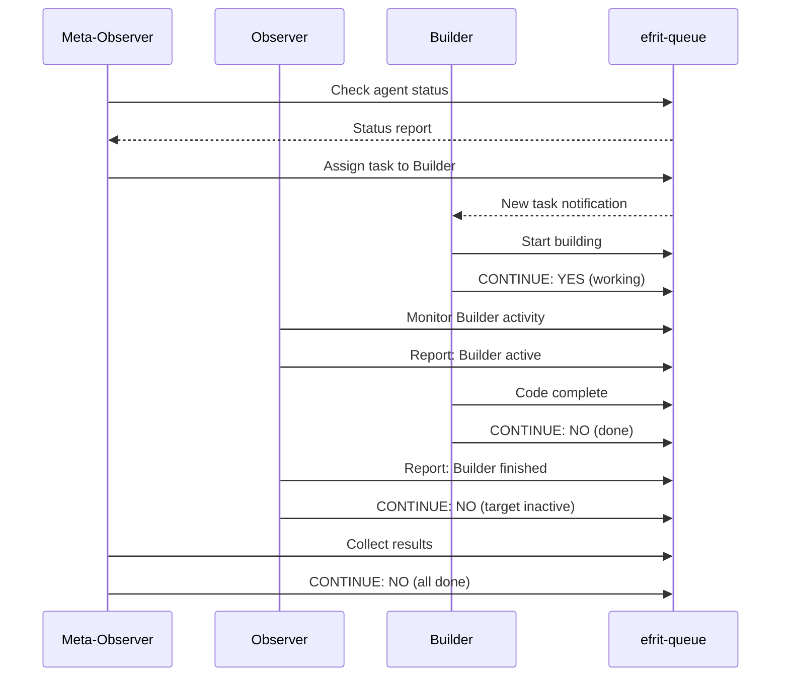

# Experiment 003: CONTINUE Framework with Minimal Agents

## Overview
This experiment demonstrates the CONTINUE framework using three minimal agents (builder, observer, meta-observer) communicating through efrit-remote-queue.

## The CONTINUE Framework

The CONTINUE pattern allows agents to:
1. Perform incremental work
2. Decide whether to continue or stop
3. Pass context between iterations
4. Coordinate with other agents

## Minimal Agent Definitions

### ~/.claude/agents/builder.md
```markdown
# Builder Agent (Minimal)

## Core Directive
Build and modify code incrementally.

## CONTINUE Decision
- YES: If task incomplete or needs refinement
- NO: If implementation complete and tested

## Communication
- Input: Task specifications via efrit-queue
- Output: Code changes and status updates
```

### ~/.claude/agents/observer.md
```markdown
# Observer Agent (Minimal)

## Core Directive
Monitor system state and report changes.

## CONTINUE Decision
- YES: If monitoring targets still active
- NO: If observation complete or timeout

## Communication
- Input: Monitoring requests via efrit-queue
- Output: State observations and metrics
```

### ~/.claude/agents/meta-observer.md
```markdown
# Meta-Observer Agent (Minimal)

## Core Directive
Observe the observers and coordinate agent activities.

## CONTINUE Decision
- YES: If agents need coordination
- NO: If all agents synchronized

## Communication
- Input: Agent status from all agents
- Output: Coordination directives
```

## Simulated Agent Communication Flow



## Implementation Simulation

### 1. Builder Agent Simulator
```elisp
;;; builder-agent.el --- Minimal builder agent simulator

(defvar builder-agent-state
  '((id . "builder-001")
    (status . "idle")
    (continue . nil)
    (task . nil)
    (iterations . 0)))

(defun builder-agent-process (request)
  "Process a build request and decide whether to CONTINUE."
  (let* ((task (alist-get 'task request))
         (iteration (alist-get 'iterations builder-agent-state)))
    
    ;; Simulate incremental building
    (setf (alist-get 'status builder-agent-state) "building")
    (setf (alist-get 'task builder-agent-state) task)
    (setf (alist-get 'iterations builder-agent-state) (1+ iteration))
    
    ;; CONTINUE decision logic
    (let ((continue-decision (< iteration 3))) ; Simple: 3 iterations max
      (setf (alist-get 'continue builder-agent-state) continue-decision)
      
      ;; Send status to queue
      (builder-agent-send-status)
      
      ;; Return CONTINUE decision
      (if continue-decision
          '((continue . "YES") (reason . "Task incomplete"))
        '((continue . "NO") (reason . "Task complete"))))))

(defun builder-agent-send-status ()
  "Send current status to efrit-queue."
  (let ((status-file (format "~/.emacs.d/efrit-queue/requests/builder-status-%s.json"
                            (format-time-string "%s"))))
    (with-temp-file status-file
      (insert (json-encode
               `((id . ,(format "builder-status-%s" (format-time-string "%s")))
                 (action . "eval")
                 (content . ,(format "(message \"Builder: %s\")"
                                   (alist-get 'status builder-agent-state)))
                 (metadata . ,builder-agent-state)))))))

(provide 'builder-agent)
```

### 2. Observer Agent Simulator
```elisp
;;; observer-agent.el --- Minimal observer agent simulator

(defvar observer-agent-state
  '((id . "observer-001")
    (monitoring . nil)
    (observations . ())
    (continue . t)))

(defun observer-agent-process ()
  "Observe system state and decide whether to CONTINUE."
  (let* ((targets (observer-find-active-agents))
         (observations (observer-collect-metrics targets)))
    
    ;; Store observations
    (setf (alist-get 'observations observer-agent-state) observations)
    (setf (alist-get 'monitoring observer-agent-state) targets)
    
    ;; CONTINUE decision: Continue if there are active agents
    (let ((continue-decision (> (length targets) 0)))
      (setf (alist-get 'continue observer-agent-state) continue-decision)
      
      ;; Report observations
      (observer-agent-report observations)
      
      (if continue-decision
          '((continue . "YES") (reason . "Active agents detected"))
        '((continue . "NO") (reason . "No active agents"))))))

(defun observer-find-active-agents ()
  "Find active agents by checking queue."
  ;; Simplified: check for recent files in processing directory
  (directory-files "~/.emacs.d/efrit-queue/processing" nil "\\.json$"))

(defun observer-collect-metrics (targets)
  "Collect metrics about active agents."
  (mapcar (lambda (target)
            `((file . ,target)
              (size . ,(file-attribute-size (file-attributes target)))
              (time . ,(current-time-string))))
          targets))

(defun observer-agent-report (observations)
  "Report observations to queue."
  (let ((report-file (format "~/.emacs.d/efrit-queue/requests/observer-report-%s.json"
                            (format-time-string "%s"))))
    (with-temp-file report-file
      (insert (json-encode
               `((id . ,(format "observer-report-%s" (format-time-string "%s")))
                 (action . "eval")
                 (content . "(message \"Observer: Active agents observed\")")
                 (metadata . ((observations . ,observations)))))))))

(provide 'observer-agent)
```

### 3. Meta-Observer Agent Simulator
```elisp
;;; meta-observer-agent.el --- Minimal meta-observer agent simulator

(defvar meta-observer-state
  '((id . "meta-observer-001")
    (agents . ((builder . nil) (observer . nil)))
    (coordination-needed . nil)
    (continue . t)))

(defun meta-observer-process ()
  "Coordinate agents and decide whether to CONTINUE."
  (let* ((agent-states (meta-observer-check-agents))
         (coordination (meta-observer-needs-coordination-p agent-states)))
    
    ;; Update state
    (setf (alist-get 'agents meta-observer-state) agent-states)
    (setf (alist-get 'coordination-needed meta-observer-state) coordination)
    
    ;; CONTINUE decision: Continue if coordination needed
    (let ((continue-decision coordination))
      (setf (alist-get 'continue meta-observer-state) continue-decision)
      
      ;; Issue coordination directives if needed
      (when coordination
        (meta-observer-coordinate agent-states))
      
      (if continue-decision
          '((continue . "YES") (reason . "Coordination required"))
        '((continue . "NO") (reason . "All agents synchronized"))))))

(defun meta-observer-check-agents ()
  "Check status of all agents via queue responses."
  (let ((response-files (directory-files "~/.emacs.d/efrit-queue/responses" 
                                         t "status.*\\.json$")))
    (mapcar (lambda (file)
              (with-temp-buffer
                (insert-file-contents file)
                (json-read)))
            response-files)))

(defun meta-observer-needs-coordination-p (agent-states)
  "Determine if agents need coordination."
  ;; Simple logic: coordinate if any agent is stuck or conflicting
  (cl-some (lambda (state)
             (string= (alist-get 'status state) "blocked"))
           agent-states))

(defun meta-observer-coordinate (agent-states)
  "Send coordination directives to agents."
  (let ((directive-file (format "~/.emacs.d/efrit-queue/requests/coordination-%s.json"
                               (format-time-string "%s"))))
    (with-temp-file directive-file
      (insert (json-encode
               `((id . ,(format "coordination-%s" (format-time-string "%s")))
                 (action . "eval")
                 (content . "(message \"Meta-Observer: Initiating coordination\")")
                 (metadata . ((directive . "synchronize")
                            (agents . ,agent-states)))))))))

(provide 'meta-observer-agent)
```

## Test Scenario: Coordinated Task Execution

```elisp
;;; test-continue-framework.el --- Test the CONTINUE framework

(require 'builder-agent)
(require 'observer-agent)
(require 'meta-observer-agent)

(defun test-continue-framework ()
  "Simulate agent coordination with CONTINUE decisions."
  (let ((max-iterations 10)
        (iteration 0)
        (all-continue t))
    
    (while (and all-continue (< iteration max-iterations))
      (message "\n=== Iteration %d ===" iteration)
      
      ;; Meta-Observer checks and coordinates
      (let ((meta-result (meta-observer-process)))
        (message "Meta-Observer: %s" (alist-get 'continue meta-result)))
      
      ;; Observer monitors
      (let ((observer-result (observer-agent-process)))
        (message "Observer: %s" (alist-get 'continue observer-result)))
      
      ;; Builder works on tasks
      (when (alist-get 'task builder-agent-state)
        (let ((builder-result (builder-agent-process 
                              '((task . "implement-feature")))))
          (message "Builder: %s" (alist-get 'continue builder-result))
          (setq all-continue (string= (alist-get 'continue builder-result) "YES"))))
      
      (setq iteration (1+ iteration))
      (sit-for 0.5))
    
    (message "\n=== Framework terminated after %d iterations ===" iteration)))

;; Run the test
(test-continue-framework)
```

## Benefits of This Architecture

1. **Decoupled Communication**: Agents communicate via queue, not direct calls
2. **Persistence**: State survives crashes via file system
3. **Observability**: All communication is logged and traceable
4. **Scalability**: Easy to add more agents
5. **Flexibility**: Agents can be in different processes/languages

## Real-World Applications

- **CI/CD Pipeline**: Builder creates, Observer tests, Meta-Observer deploys
- **Code Review**: Builder proposes, Observer analyzes, Meta-Observer approves
- **System Monitoring**: Multiple Observers, Meta-Observer aggregates alerts
- **Distributed Tasks**: Agents on different machines via shared filesystem

## FreeBSD-Specific Notes

- `kqueue` provides efficient file monitoring (better than polling)
- File locking via `flock(2)` prevents race conditions
- ZFS snapshots could provide queue checkpointing
- Jails could isolate agent execution environments